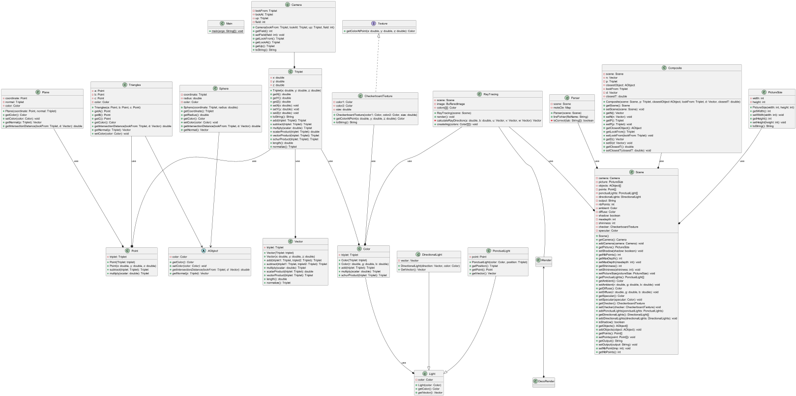
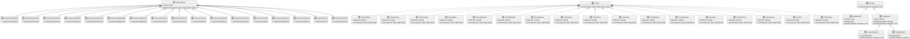

# S3.01 Développement d'applications

## Développeurs

**Valentin Damlencourt**  
**Aude Halipré**  
**Alban Lagragui**  
**Thomas Royer**

## Objectif de la SAE

- Implémentation en Java d'une bibliothèque proposant un lanceur de rayons
- Doit pouvoir être exécutée depuis la ligne de commande
- Le lancer de rayons permettra de générer par ordinateur des images avec un effet 3D, en simulant le
  parcours de la lumière au sein du’une scène, dans laquelle se trouvent des objets qui sont éclairées
  par cette lumière.

## Diagramme de classe du projet

## Comment lancer le projet

`gradle build`

`gradle run --args 'script/sphere.txt'`
